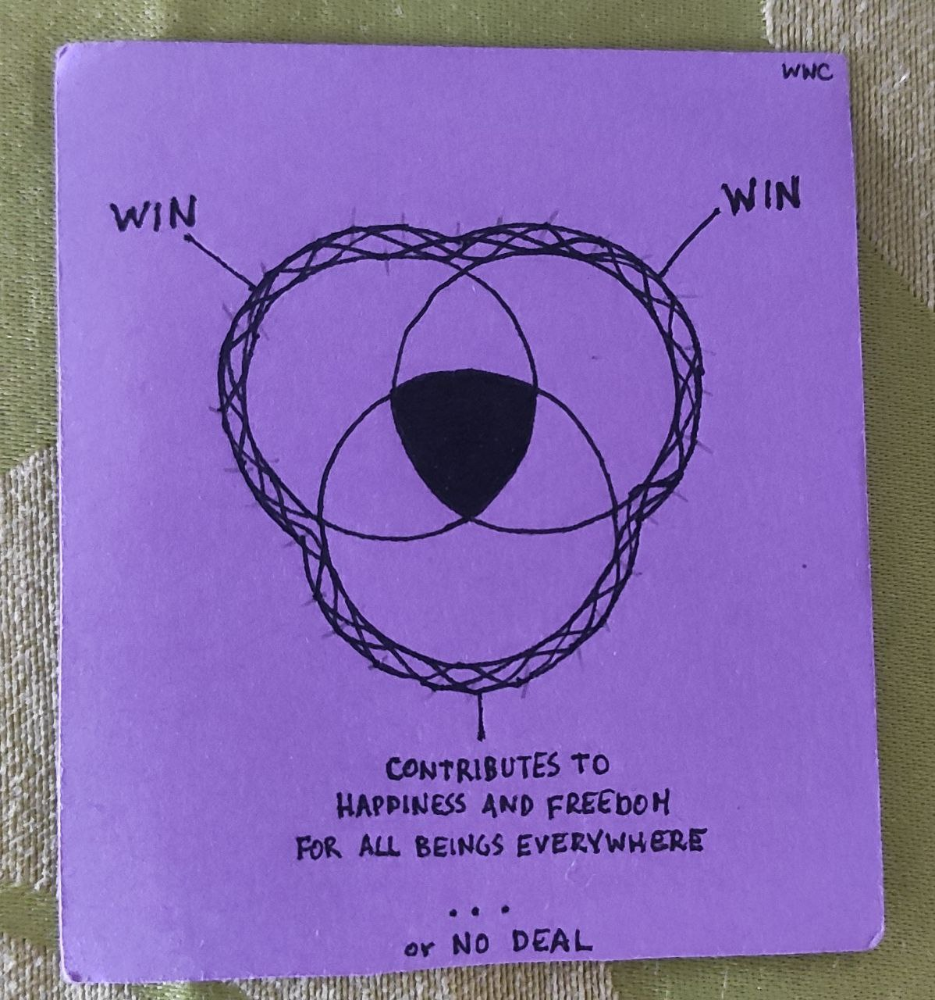

# About ☀️

**I'm a multidisciplinary artist, sailor, and a community catalyst in a tiny island.** And, of course, ****a Shapeshifting Raccoon by night 🦝.

I'm also **documenting the process** for the benefit of all beings. ✨

This is my digital journal.


I'm still figuring out the role of this space in my digital ecosystem. At the moment I'm experimenting with making it a complimentary space to my [personal website](https://michalkorzonek.com), because I want something more bloggish, I'm done working with Wordpress, and I'm not keen on spending more time to learn how to code atm.  
  
Get my [Moonly Reviews](https://mindjuggling.substack.com) 🌑🌕 for updates on the projects I'm working on.


### Intention

I’ve created this space to **practice learning by building in public**, with four main intentions:

1. **Develop bias towards action.** I often get stuck in collecting ideas for the sake of it and/or perfecting them infinitely before making any practical use of them.
2. **Practice vulnerability** by sharing my process and ”unpolished” content online, and ideally–create feedback loops to improve my thinking by engaging with you.
3. **Explore** _**play**_ **in the digital space**. Digital often feels laborious and/or overwhelming. I know that the key \(for me\) is to make it playful. Let’s see if I can find digital workflows and toolkits to give me a similar sense of play and freedom to the offscreen world.

Last but not least:

4. **Document my process of building sovereignty, sense-making, and living a happy, healthy and fulfilling life–for the benefit of all beings.**

_**Triple Win**_ – A “win-win-win” scenario, meaning a win for me, a win for the other, and a win for all beings. 🌍🐲

It’s \(obviously\) easier said than done, but that’s a principle I would like to embody in my day-to-day life.

### Navigation 

All my notes \(entries to this digital journal / posts\) are here:



Here are links to my documentation projects:



And here's what I'm manifesting, at the moment:



### **Disclaimer**

This is a **continuous work in progress.** Things might be messy. ****Also, my English grammar is not my forte, and I'm slightly dyslexic. Enjoy the ride.

### Naming the Elders 🧙🏻‍♂️ \(although they’re not really that old\)

This little project is inspired by the work and support of a few amazing people, but these three definitely should be named explicitly:

Thanks, [Richard Bartlett](http://richdecibels.com/), for emphasizing the **importance of taking action** and **focusing on** _**verbs**_**, not** _**nouns**_. And thanks for [Microsolidarity](https://www.microsolidarity.cc/). Your work is magic. 🙏

And thanks, [Anne-Laure Le Cunff](https://anne-laure.net/) for building [this little beauty](https://www.mentalnodes.com/), which provided the ignition spark that kick-started **building my digital journal in public**. 🙏

Finally, thank you [Silvia Bastos](https://twitter.com/@this_is_silvia), for being the most amazing \(and fun\) creature I have ever encountered. 🙏


This is definitely not extensive list of Elders. The full list lives inside my heart, which contentiously radiates gratitude towards all of them ✨.  
  
_"I am a part of all that I have met;   
Yet all experience is an arch wherethro'   
Gleams that untravell'd world whose margin fades   
For ever and forever when I move."  
  
–_ Ulysses, by Lord Alfred Tennyson


