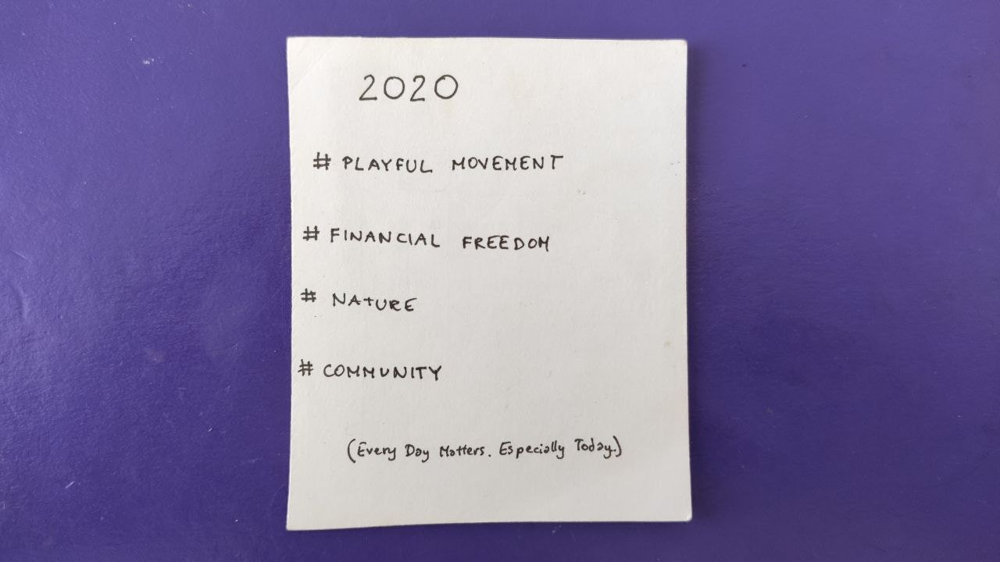

# 2020

### \#Playful Movement

I’m spending too much time in my head. Fortunately, I’m also a juggler.

While crafting my 25 Year Vision as a part of my yearly review, I wrote down that ”_I exercise daily and can perform impressive stunts_” 🎪

Which led me to set these two goals for 2020:

**1.Exercise every day**





**2. Learn one new type of movement**



And so far it’s been going better than expected. In fact, I’ve recently observed, with quite a degree of satisfaction, that I’ve entered the **Movement Vortex**.

#### Movement Vortex

**The more physical movement I do, the more my body craves physical movement.** It’s an amazing upward spiral that I’m riding at the moment, with a tremendous dose of joy. So I keep on adding more and more movement to my routine, which not only makes me happier and more energised, but also takes me out of my head, which is what I definitely need.

You can see my routine experiments below:



Btw, as I’m writing this, I’m noticing that my body is telling me to jump into the pool and do a few rounds. And then it’s time for handstands 🙌

I can’t freaking wait.

### \#Community

Moving from the self towards a thriving community.

I’ve spent the last 3 years working intensely on various areas of ”personal development”:

* radically transforming my diet
* radically transforming my body
* figuring out that emotions are actually important, dropping the _macho_ bullshit and learning how to be vulnerable \(with various rates of success\)
* and more

However, in the process **I pretty much completely neglected reaching out and ended up feeling like I lack a supportive network of people interested in going deep into self-work and empowering each other to grow together and start shifting the world towards something that makes more sense that capitalism.**

Paradoxically, I don't think that's a bad thing. I just needed some time to sort out out my own shit first, and only then move to building meaningful relationships with people whom I want to grow together with. _Intentionally._

And now I'm not only "ready" to do it, but I'm in the process already.









