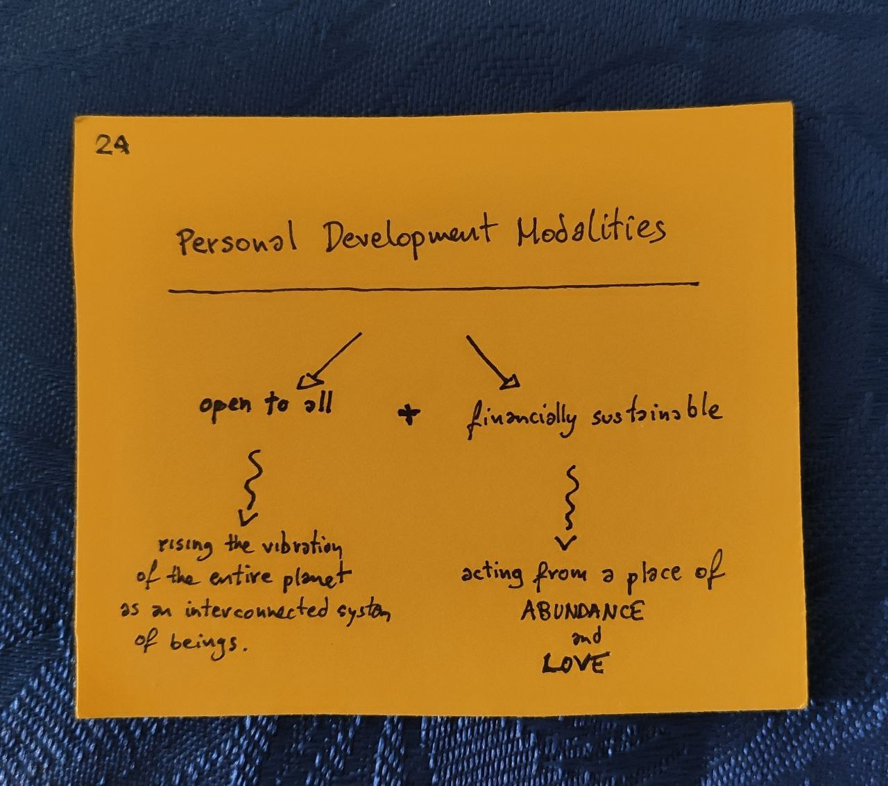

# \#Financial Freedom


This was one of my focus areas in [2020](../).


I grew up in a poor family.

Or at least I thought so, until I realised that there is a disturbing amount of people who are actually _poor_, and I really have no clue what poverty looks like. 

So, yes, I am aware that I speak from a privileged position of a white lower-middle-class male with an EU passport and higher education, but that doesn’t render my experience invalid. And I did grow up with a feeling of _being denied_ things and experiences, because, as my mum was saying repeatadly ”we can’t afford it”, which left me doubting my worth and installed some fucked-up patterns deep inside my personality.

I’m actually very happy that I couldn’t afford stuff, as it pushed me to look for alternatives. And those experiences, like _hitchhiking_ \(because I couldn’t afford a bus or plane\), _dumpster-diving,_ and Rainbow Gatherings, shaped me into who I am today, and I wouldn’t swap my experience for any amount of $€£.

On the other hand, I’m quite confident that there’s plenty of money to go around for everyone \(myself included\), and I know that to do my best work, I can’t be worrying about affording healthy food.

That is if I want to be using money at all \(and I know that there are people who are thriving without it\), but it’s a choice I’m making because I don’t feel ready \(yet?\) for a lifestyle completely removed from the financial system.

And that brings the ”million dollar” question \(pun intended\):

**How can I make a comfortable living, so I can focus on doing meaningful work?** 

For context, I’m doing my best work in _personal development_ \(think helping people grow\) and _experience design_ \(think designing and facilitating growth-enhancing experiences\). And that triggers an immediate conflict in my head 🚨:

**How do I put financial value on personal development?** 

And

**How can I share my knowledge and skill with people who can benefit from it but not always can afford it, while being financially sustainable and acting from a place of Love and Abundance?**

It’s a tough nut to crack. And I know that I’m not the only one who’s cracking it.

