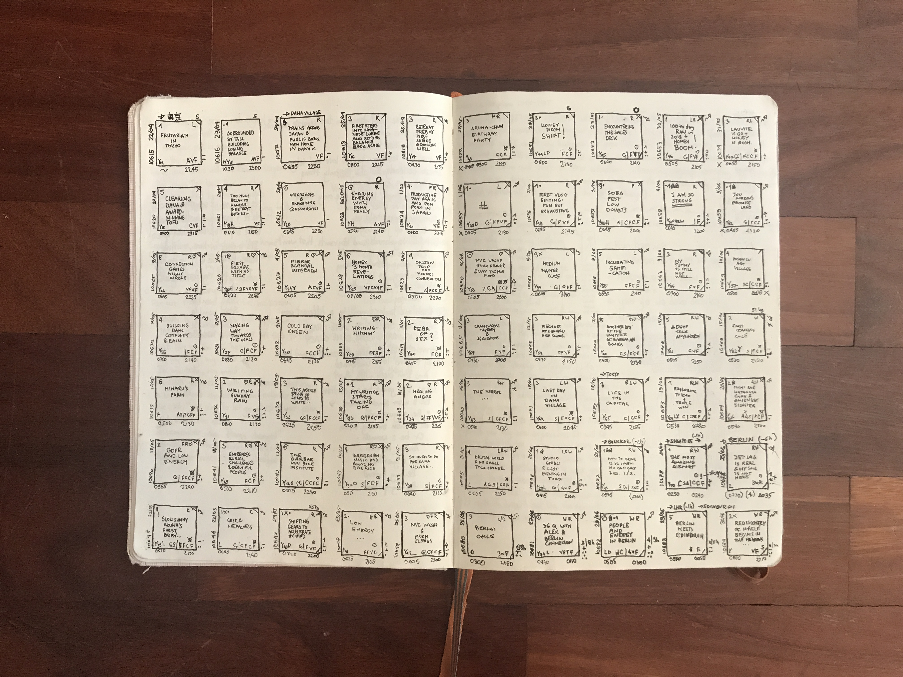
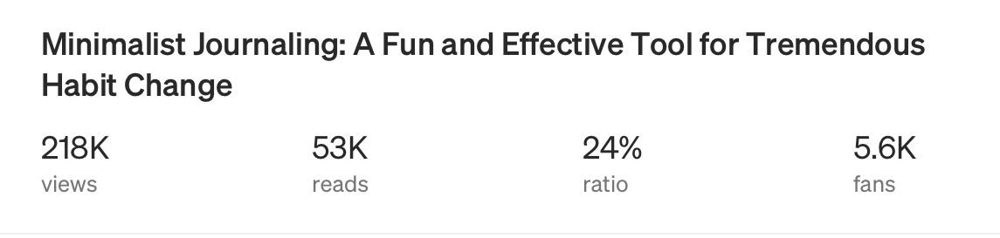

# The Minimalist Journaling System

It's quite an amazing story:

One beautiful day, back in the wonderful Koh Phangan island, Silvia looked through my shoulders and suggested that I should totally write an article about my "squares". 

She has been observing me for some time, having a total blast while radically changing my [routines](../../routine-design.md), diet, and having more [fun]() and [clarity]() over my life in general. All of that with a simple journaling method I have been playing around with for some months.

A few weeks later, I published my very first "proper" [article](https://medium.com/better-humans/draft-how-to-hack-your-brain-to-achieve-consistency-that-lasts-7f5fdc520d28) online, explaining the why and how the Minimalist Journaling System works for me.

I had zero expectations.

And then something strange happened:

**The success of the Minimalist Journaling System, measured not in fancy metrics but actual responses and results reported by real people** who started to reach out to me via all imaginable online channels, **gave me confidence that I created something valuable and worth sharing.** 

It also kickstarted [JournalSmarter](https://journalsmarter.com), and became our flagship product—an online course combined with a premium group coaching experience spread over 3 months—just enough to build and _maintain_ new habits, while learning experientially the ins-and-outs of the system and customizing it to fit individual needs.

And now, **we're about to launch version 2 of the course, implementing everything we have learned over the last 2 years to create a powerful personal development experience for a group of people supporting each other in a nurturing environment.**

I've learned the hard way not to set expectations.

So, I'll set an intention instead—I'd love to work with a group of 25 highly committed people, wanting to grow together. 

Yes, habit change can be fun and simple. Yes, journaling is the cornerstone habit for profound life transformation. Yes, there's nothing quite like a group of people committed to share this experience together.

**If you'd like to be a part of it, you** [**can**](https://journalsmarter.com/minimalist-journaling-system?utm_source=gitbook&utm_medium=digital-journal&utm_campaign=michal)**.**

TBC

