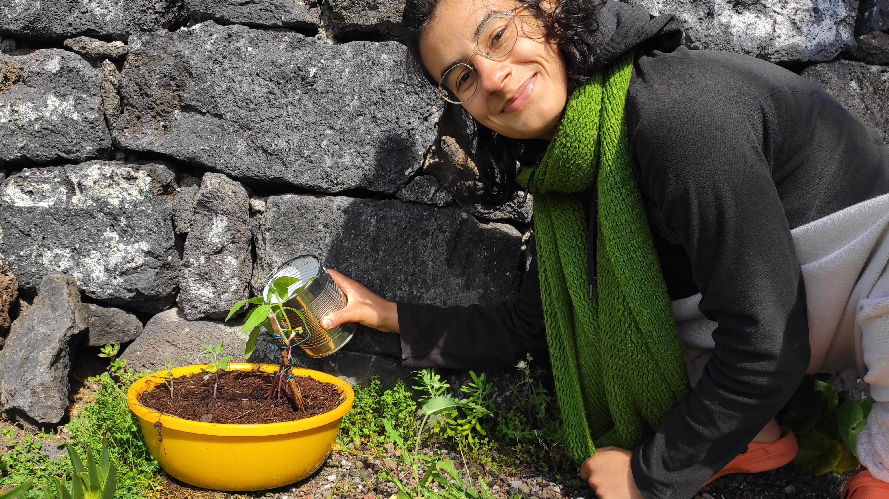

# Growing Food 🌱

Two days ago our neighbors brought us a small box of tomatoes from their garden and 2 tomato plants. The tomatoes tasted _incredible_. The tomato plants made me realize that I have absolutely zero idea about growing my own food. They now stare at me and ask to be planted. I guess I should take the first step, instead of letting them die, right?

🍅🍅

But how does one even start?

I've spend a day helping out a [man in Japan](http://chardjou-sol.com/) who grows award-winning tomatoes, but I'm pretty sure that I'm not looking for that level of expertise at the moment. Instead, I'd like to **find the most hassle-free way of growing tomatoes with a minimal barrier of entry, so I can start \(ideally\) today, learn experientially from day 1, and \(hopefully\) successfully grow a single tasty tomato.** Just enough to prove to myself that I can do it.

### Log

**30 May 2020:** We’re adding mint to our garden.

**25 May 2020:** The plants seem to be growing. I’m also noticing, that it’s probably going to be a long time until I’ll have something worthwhile to log here...

**21 May 2020:** We finally plant our tomato plants \(which we call Tom & Jerry\) into their new home. Somehow it feels very symbolic—a transition towards _embodying_ the GameB ideals.

Oh... And it turned out that Tom is actually a sunflower 🌻. Surprise!

**19 May 2020**: I create this whole section and decide that I want to learn how to grow tomatoes. Or at least give it a shot. No expectations.

**17 May 2020:**  I received two tomato plants. My food growing experience is zero, but I am freaking _good_ with building habits. Let's see what happens.

