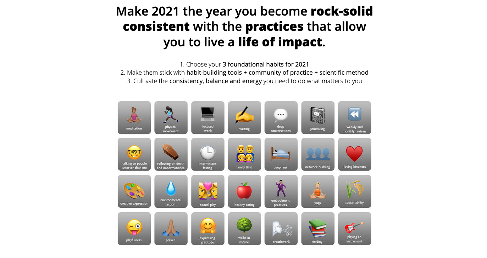

# 2021

This year I'm co-creating a relational-growth habit-building experiment, the Year of Practice.

I have a rough idea what will be my practices for 2021, but instead of setting them in stone in the beginning of the year, I'm starting with a single point of focus:



In the meantime, I've created tiny habits for my other practices, while keeping in mind that they might change over the year. This allows me for more flexibility, which I really enjoy.

