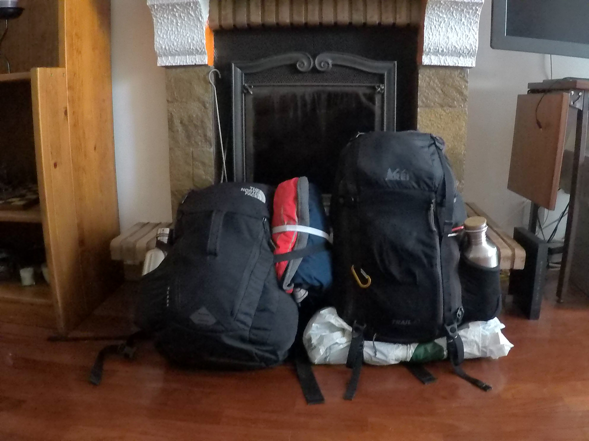
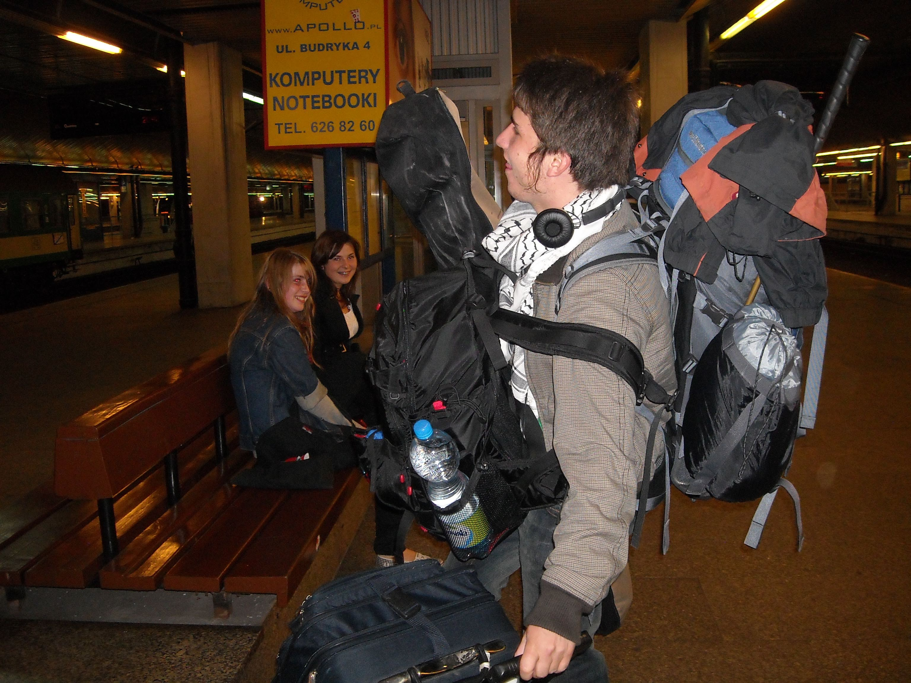

# Backpack 🎒


It's kinda hilarious. After living in one place for over a year, I've accumulated a lot of stuff again. Well, it's not really a lot for most people standards, but it doesn't fit into one \(or three\) 40l backpacks anymore. I can sense a decluttering time approaching.


Silvia and I are living our lives from a 40 litre backpack.

40l contains all our clothes, electronics, and gear allowing us to work, exercise, and explore wilderness, while making our travel light and hassle free \(yes, the backpacks can be carried on board an aircraft, so we never check-in our luggage\).

Here’s the best part:

**By being intentional and extremely selective of what we own, we created a perfect combination of items, which enhance our lives without being a burden.**

However, it was not always this way.

In fact, when I first moved to spend a whole year abroad I took with me:

* 80l backpack on my back
* 40l backpack in front of me
* A gigantic suitcase rolling behind me
* A laptop case on my shoulder
* A snowboard bag on my other shoulder

It must have been a 100kg of stuff. I still don’t know WTF was I thinking.

To make it more exciting, on the way back the wheels of the suitcase fell off , so I had to literally drag the whole damn thing through the train station. I still remember the sound it was making.

So yeah, nowadays things are quite different.

However, **minimalism doesn’t apply exclusively to the things I carry with me. Instead, it’s a mindset of reducing the clutter, simplyfying and making space–both physical and mental.** 

Less is more.

Below is a little story of how I got rid of most of my belongings when I was leaving my beloved Edinburgh to become location independent:



It was really quite fun.

* [ ] Add my gear list. Almost every single item is oh-so-worth recommending.

