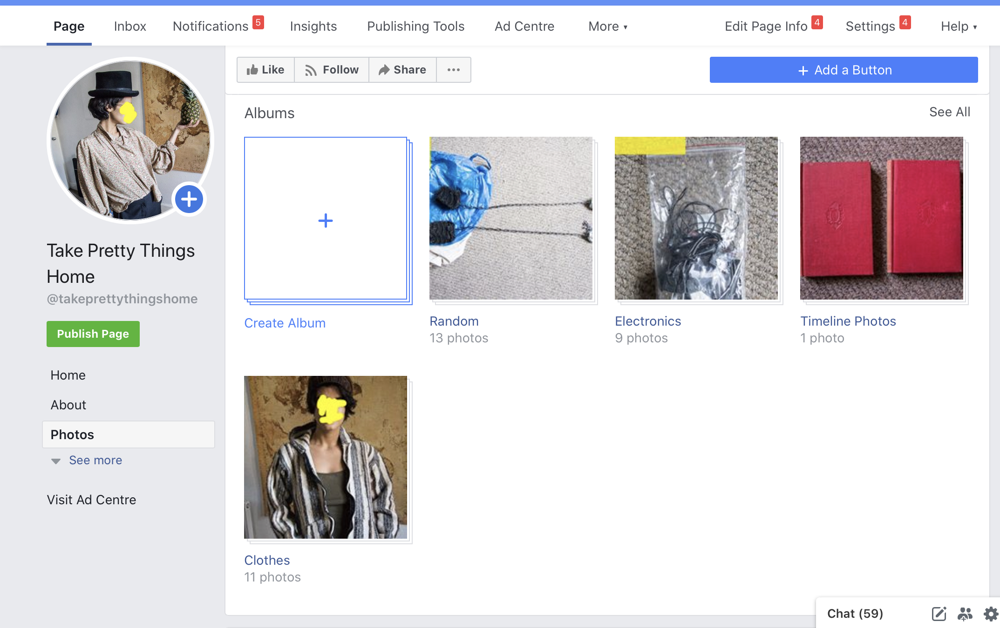

# Decluttering

Selling on ebay is a good idea, but it’s so much freaking hassle if you have an entire flat’s worth of stuff you have been accumulating over a few years.

Giving things to charity is amazing, but before, I’d rather see if some people would like to take my precious belongings, or exchange them for fruits, quality time \(back massages are always welcome\), or a few of the very specific things I need.

Here’s how I did it:

**Step 0:** I’ve had some fun photographing all my stuff, especially clothes \(fashion show!\). It took a few hours to complete.

**Step 1:** I wrote [this message](https://docs.google.com/document/d/1xvfUBbPxdkk9KnqsWBO31yLYGWC_zBZGC5JQaWn3rXY/edit) and sent to pretty much everyone I knew in Edinburgh. The message included a link to [this spreadsheet](https://docs.google.com/spreadsheets/d/1a2DjVERIyBkX-IcPAIouj1dxyidkOySQ5kexizMKavY/) listing all items, descriptions, photos and a list of desirable things for a swap.

**Step 2:** I created a facebook page with pictures of the items and shared with everyone and asked to share further to get some strangers interested. I posted in on some local groups, too.

**Step 3:** I had a blast as I was getting the most wonderful offers for swaps and seeing things disappearing without much hassle.

My favourite swaps included a huge bag of delicious fruits exchanged for my trusted whiteboard, and a story by a professional storyteller swapped for a bicycle. Totally worth it.

