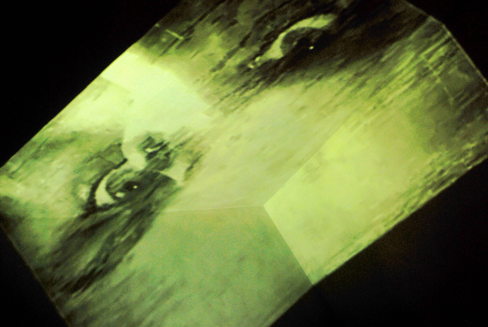
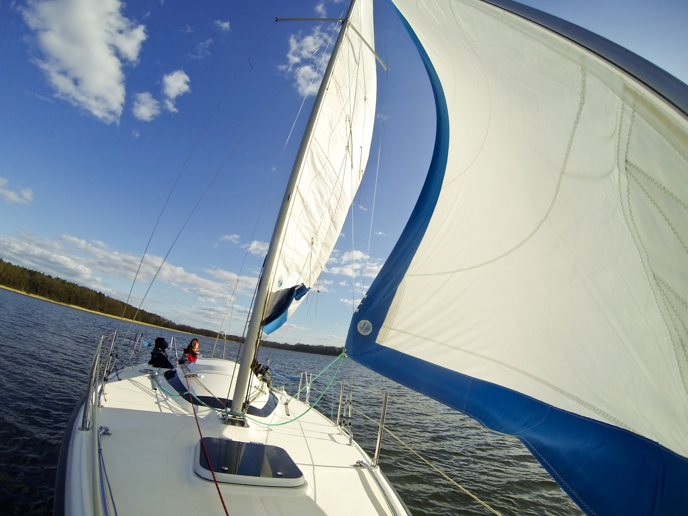

# Experience Design

Creating experiences for people, or actually _co_-creating experiences _with_ people, is when I feel like a happy fish in the water [🐠](https://emojipedia.org/tropical-fish/). Here’s how it evolved over the years.

### Interactive Party Spaces

It all started when as an 18-year-old I got bored with the repetitiveness of parties. People get together, some get drunk or stoned, some make out, some do some stupid stuff. It’s all great and fun, but I wondered if there can be more to a party than that.

That’s when I started experimenting with **designing interactive party spaces, to bring more variety and facilitate novel types of interactions.**

A few examples:

**Sounds in the Bathroom** – hidden speakers playing various sounds separated by long chunks of silence. The people who actually heard stuff \(birds, people having sex, crying children, demon voices, whispers and more\) were never sure if it actually happened, or was it just the booze or drugs they consumed. 😈

* [ ] Look through the old HDD to find the sound files.

**The Maze** – hanging large pieces of heavy material from the celling allows to create a wonderful sense of confusion. It works particularly well in ”transitional” spaces, such as lobbies, through which you can access multiple other spaces. ****

**The Tunnel** – blocking the access to one of the rooms so the only way to enter is to crawl through a narrow tunnel. This breaks the usual pattern of spending most of the party time standing or sitting, which opens a whole new dimension to explore.

**Tents, tents and more tents ⛺️** – pitch tents around the party space, or build tent-like structures. It adds a layer of intimacy and facilitates intense interactions.

**The Art Wall** – an entire wall covered with paper \(or pieces of paper\), with plenty of different art supplies around. The stuff people create can be quite amazing.

**Questions** – Pieces of paper with various questions hanged all around the house. This works as an excellent conversation starter between strangers and becomes quite a beautiful memory from the party.

* [ ] Where are the photos? I remember taking them.

**Visualizations** — That's quite an obvious one. The weirder the better, ideally displayed on uneven surface, and if possible, then connected with some video equipment to make it interactive.

**Art —** Another easy one, but always makes a difference. Invite a few artists, and display their work.

**The Meatphone 🥩** – A phone booth on the wall, from which you can call a number and talk to the ”meat dealer”. He shows up dressed in a suit, with a suitcase full of meat. I’m vegan now, so I’d rather turn the meat into fruits 🍍.

**Make Out Room** 😘 — It's always attracting some interesting conversations and interactions. For more spice, add a slider on the doors allowing anyone to change between "vacant", "occupied" and "join in".

**The Dice 🎲 –** \(Ideally\) a 20-sided dice facilitating interactions for those who dare to roll it. It’s an amazing ice-breaker, and allows you to introduce very specific types of interactions into the party.

**Breathing Session on the Dancefloor** – at 2 am get the DJ to play some meditative sounds and host a 30-min guided breathing / meditation session. It’s magical.

🎥 Here are a few videos from a few notable parties:

**Magic Spells**, crafted in 2011, with ❤️ and 👓, together with Olek, [Agata](https://vimeo.com/agatamusial), and a few amazing artists in a not-yet-fully-built apartment. Here’s the [video](https://vimeo.com/michalkorzonek/magicspells).

**20+4/11.DR1651F1** \(the names were gradually becoming more hipster\), hosted in 2012 with Liisa, Dora, Tom and Thomas in our wonderfully mad flat ”Casa del Cine”. Here's the [video](https://vimeo.com/138565331).

**24 Planets,** a 3-day long birthday festival in 2013 to celebrate turning 24 by Liisa and myself. This party was amazing and totally mad. We never got to see the footage afterwards–it somehow got destroyed during the party and perhaps rightfully so. The one thing that’s left is this one polaroid picture of my not-quite-sober self: 

 Okay, enough about parties.

### Interactive Art

Radio Ion

Oasis

Parallel

### Collective Development Experiences

* [ ] What is a better name for _doing personal development together_?

**Team-building in Tirana**

When I was invited to preside the European Youth Parliament Session in Tirana I couldn’t say ‘no’–I have been there as an editor a few months earlier and I absolutely loved the people.

In the same time I was noticing that EYP is taking too much of my mental space, and it’s time to shift into something else. I’ve decided that 1\) it will be my last session, 2\) I’ll do everything I can to make it incredible.

And it definitelly was, although that’s not solely because of my efforts. The people really were _magic_. But there is one part that I’ve designed from scratch \(with help of my wonderful VPs, Elisa and Nata\), that I felt quite proud of: the teambuilding for the officials \(around 20 people\).

At the time, the standard formula was to start in a big circle with some energisers and name games, and then move into connection-building activities in smaller groups. That didn’t really work for me, so I flipped it around.

The process started with a **walk in pairs**. This way there was no need for name games \(I find them highly ineffective\) and there was a space to go deeper right from the start. The pairs then joined in **groups of four**, then **eight** and so on. Since people already had a ”solid social foundation” established, they easily merged and got to know each other in bigger groups.

The activities had a strong ”treasure hunt” vibe going on, leading towards the climax: **building a home together,** when the entire group designed and built a comfortable space where they could hangout during the session. We gamified the process to make it more fun and dynamic. Within half an hour, we transformed an anonymous room, into a welcoming space which we all ended up treasuring, and spent plenty of time together throughout the session.

#### Words Without Wires

TBC

#### Sailcubator ⛵️

Here’s a little message I sent to a couple of dear friends back in 2017:

> There is something magical in being in the middle of the water.
>
> The idea of sailing as freedom might be commercialised \(think Jack Sparrow\), but is not far fetched. Sailing can indeed give the feeling of ultimate freedom. More importantly, it creates space to reconnect with nature and gives time to reconnect with oneself.
>
> I would like to invite you to join me on this adventure and sail together.
>
> There will be plenty of opportunities to learn sailing. We will be nurturing ourselves with delicious vegetarian food. We will have time to relax in the company of beautiful people and share profound and inspiring moments. There will be space for music, singing, dancing around the fire, swimming, yoga, playing games and whatever else your soul needs!
>
> You don’t need any previous sailing experience and you are in safe hands.
>
> This is a video from sailing trip back in 2015. 
>
> [https://youtu.be/RRq6EBm0oP0?t=9m23s](https://youtu.be/RRq6EBm0oP0?t=9m23s)
>
> Feeling the vibe?

This was my very first test of **combining personal development with sailing**. And it worked extremely well.

And this is where I’d like to be heading in the next few years–spending a big chunk of my year somewhere on the high seas of this beautiful world, sharing this adventure with a few wonderful human beings. 

But for now I need to build my sailing experience. It’s definitely not something you can learn from a book.

If you hear of a right boat for me, let me know. Here’s my [sailing CV](https://docs.google.com/document/d/1c8Wwasc4hcZmcr3-vKQ7vob_qOVndH8YsupfS4xFUUo/edit) to pass along ☀️.

#### [The Minimalist Journaling System Online Course](2020/financial-freedom/the-minimalist-journaling-system.md) [🔗](https://emojipedia.org/link/)

#### [JournalSmarter Mastermind](2020/financial-freedom/journalsmarter-mastermind.md) [🔗](https://emojipedia.org/link/)

