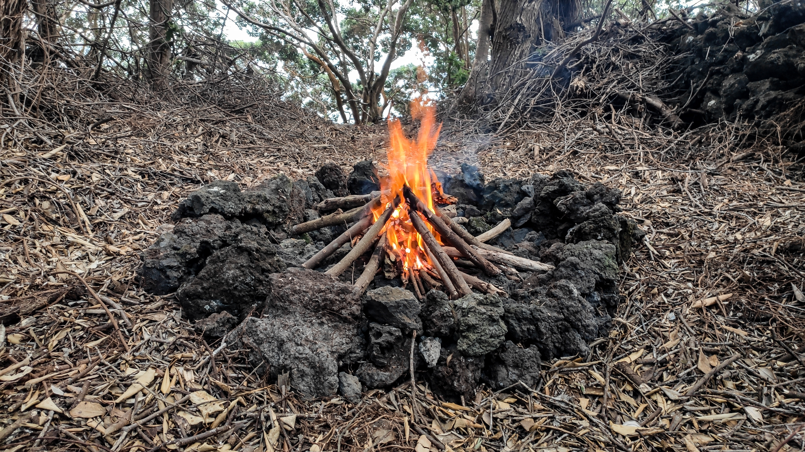

# Forest Log 🌳

🌳

**At the end of June I sensed a Call**.

It was a kind of deep feeling, a glimpse of intuition, telling me quite clearly to move into a forest. The idea resonated with me and the timing was perfect: it's summer time and I had to move out of my house anyway. But, I didn't answer the call and moved to another house.

But the Call was getting stronger and eventually it was not possible for me to not honour it.

So I ditched the comfort of living in a house and moved into a forest. Here's my Forest Log, documenting the process.


This is an evolving document. Get my [Moonly Review](https://mindjuggling.substack.com) for updates and magic. And if you vibe with what I create and share, and would like me to create more, then consider offering a [gift](https://buymeacoffee.com/michalkorzonek) 💚.


### Day 1: Leaving the house

The idea is to use my car as storage and camp in a tent + hammock wherever I feel like. This way I can have different spaces in the campsite and also can have guests.

**👁 Insights:** There is no way of optimising the space / equipment before living the experience. I packed way too many things, and it's all kinda awkward, but I'm ok with it. I'll naturally optimize, as I realise what I need.

The first day I have a friend visiting Pico. I take them around to explore. In the evening we set camp in a public, yet secluded site in a magical forest. There's a nearby swimming spot, a shower, a toilet and a pop-up bar. The car + campsite combo works well.

We end up sleeping under the stars next to the fire, watching a meteor shower.

My friend shows me a ceremonial way of starting a fire, using only a match, wood and palo santo.

### Day 2: Chilling in the camp

After a day of moving around my friend and I spend most of the day in the forest. Swimming, being, reading, chilling. Life is good.

I sleep in a hammock and they sleep in a tent, as the weather is unclear and there are occasional light showers. More meteor showers in the evening. It's mindblowing.

Since my car and equipment is not optimized yet, I find it hard to keep things tidy, especially with another person.

### Day 3: On Public Spaces

I go for a day of sailing. When I come back my friend is gone already and the only thing I dream of is to go to sleep in my peaceful tent.

But the campsite has a big and loud party going on. Then there's a jeep full of drunken loud people, who after asking for beers, say that they will be back.

That's my cue to leave.

It's dark and I'm too tired to look for a spot and pitch a hammock. I decide to sleep in a car. It's a bit of a pain, because it's not optimized for this, but after a moment of moving things around I find a comfortable way to do it. It's actually quite a nice night and the place is super peaceful and quiet.

**👁 Insights:** Public spaces are great, and I do think that being exposed to other ways of enjoying time in nature is ultimately a good thing \(diversity, ftw!\). But I feel like I need peace and quiet, at the moment.

### Day 4: Moving In

I'm moving into a forest belonging to my friend.

This will be the first time where I'm going to be living in a forest for a longer period of time \(or it seems so\), not in a camping context.

I pick the spot at the very edge of the land, the furthest away from his house and right next to the ocean. I can feel the magic. A good friend is moving in with me, a few hundred meters away.

There's outdoors kitchen, electricity plug, water source in my friends place. My car also stays up there, as the path down to the camp is not possible to drive on. Since I was planning to use my car as storage, not having it next to the site changes things a lot. My tent will have to store things, which in turn limits my living space.

II think I caught a cold during my sailing day, and I feel low energy. I pick a spot, pitch a tent and sink into the forest.

### Day 5: Sleep and Recovery

I still feel tired. I pitch my hammock and start cleaning the space. I spend a lot of the day sleeping.

I go to my forest neighbour to make a big pot of ginger + lemon + cayenne tea to heal myself. I boost a few cups with a bit of raw garlic for extra healing powerz.



### Day 6: Recovery and Forest Charging

I'm feeling much better today.

I start making the space: building the firespace, a bench, doing some cleaning, placing candles, and generally speaking landing into my new home.

I spend a lot of time just being in the forest. It's incredible: I can feel a very tangible physical sensation of healing every time I just lay down on the ground.

It's a magical place.

During the day I draw the Hermit from the Tarot deck. Not surprising at all 😂.



Before going to bed, I spend some time lying on the ground and watching the trees and stars.

### Day 7: First Guests

I wake up feeling a crazy amount of energy. I guess the lemon+ginger+cayenne combined with some forest bathing is the best medicine for me.

I make a coffee on a camping gas stove of my friend, and make a song.



I go on a mission to drop some stuff I don't need, and find things I do need for the campsite. I come back with a lot of new items and ideas. The main problem is storage: my things are not organized at all, and I really need some outside storage solution. I know that a big rain is coming in two days, so it needs to be waterproof, too.

I build the fire, set it up for cooking, and have my first guest over.

**⭐️ Achievement:** I light the fire with a lighter, candle and wood. No chemicals or paper. It takes me a while, but it feels extremely rewarding.

We connect by the fire, share about our current life chapters and intentions we'd like to manifest. It feels special to be holding this space, especially since my guests are 25-27 yo and seem very receptive and curious about nature. Who knows what seeds I'm helping them plant? 🌱

* [ ] Add script

**⭐️ Achievement:** My guests are Portuguese. We speak in English, but I decide to share some profound things in Portuguese to practice speaking. I still can't follow deep conversations with numerous native speakers, but speaking is already a great practice.

**👁 Insights:** I realise that my tent is not very well positioned. My firespace also need more work. That's okay: as planned, I'm figuring out the best way of arranging things as I live my forest life. There is no other way.

Oh, and the friend who owns the land gave me permission to build some semi-permanent structures, so now I just need to get the materials and start building.

Again, before going to sleep, I spend some time lying under the trees and stars and sinking into the ground. And for the first time I sleep in a hammock.

### Day 8: First Rain and Digital Work

I wake up to a heavy rain. I get out of the hammock naked and enjoy some water falling on my body.

I go to a cafe in a near by town to do some digital work. I come back to the campsite for delivering a workshop. The internet connection is okay, so I'll be able to do all my work right from the forest.

I take some time to bring pallets from a supermarket. It's a bitch to carry them all the way down to the campsite \(no car access\), but it's going to be worth it – the pallets will be my "lego bricks" to build essential structures.

I have dinner \(courgettes and potatoes from the fire, and some fresh veg from the neighbour\) in my forest-mate's campsite. It's the first time I see it transformed, and wowzers, she did put some heart and effort into making it a beautiful space.



As usual, I sink into the soil before going to sleep. I love the forest I live in and I feel incredibly grateful to be a part of it.

### Day 9: Building a Table & Storage Solution

I wake up to a heavy rain. My tent seems to be holding up well, but there is one particular spot right above my head where an occasional drop of water falls on me. I'm not sure how it's possible. I need to investigate it further one day.

A friend brought me a camping gas stove, and I enjoy a quick morning porridge and a coffee. Unfortunately the hazelnut milk went bad overnight and I poured it into my coffee before trying it... I end up making another cup and drinking it black.

My fridge solution is a bucket with cold water, and it seems to work to an extend, but it's definitely not good enough to store stuff for a few days. Not a biggie. I'll look into a simple way of making small amounts of oat milk.

I was originally planning to do some digital work, but it's not raining \(the forecast said heavy rain\) and frankly, I'm very frustrated with the fucking mess my tent has become.

I finish my coffee and get to work.

⭐️ Achievement: Building a table/storage solution from pallets.



Here's the instruction manual:



I cover the table with a waterproof tarp I sourced from a friend, to make sure all my stuff is protected from the forcasted rain. Eventually, I'll use the tarp to build a roof solution, but I feel that different components of the campsite are not yet fixed in space, and the roof is probably the last thing to do.

I treat myself to a warm shower and deep stretching in my friends place and end the day sinking into the forest.

### Day 10: Being and Exploring

The first thing I've seen as I opened my eyes in the morning was the trees, peeking through the net in my hammock. Awwwwww...

🌳​🌳🌳

I've had a chilled breakfast and decided to start reading a book that I felt a strong calling for:



I have a feeling that it will help me unlock the economic model for a project I'm very excited about: [Evolving Experiences](https://pico.microsolidarity.cc/projects/evolving-experiences). And after reading the first two chapters I can tell that I won't be disappointed.

I had my first semi-ceremonial cacao, relaxed in the Sun, and explored the forest around me.

⭐️ **Achievement:** Found the _Fig Hill_, a small hill with an opening between the trees. The Sun always shines there, there is an almost clear ocean view, and, here's the best part: there's a small fig tree growing. It already has some fruits, but I have a feeling it won't produce much this year. In any case, I love that space and I'll keep going there to meditate.

I also found a space where I could potentially move my tent to. The space is perfect, but it would require some leveling work, and potentially building foundations from pallets.

In the afternoon, I left my forest to go for a swim, and then head to a retrospective session of the [Pico Sharing Circle](https://pico.microsolidarity.cc/sharing-circle/). I've added my [retro notes here](https://pico.microsolidarity.cc/sharing-circle/sharing-circle-v3#retrospective).

### Day 11: Painting a Roof

I spent the day away from the Forest, swimming, doing some digital work and painting a roof, which brought a surprising amount of insights.



\([click here to read the full twitter thread](https://twitter.com/michalkorzonek/status/1427575880218468394)\).

A big discovery was an amazing simple meal: brown rice + soy sauce + cayenne pepper + tomatoes \(from my friend's garden\). Oh, so delicious!

### Day 12: Forest Community

Today a third tent popped up in the forest.

I guess I can officially say that I'm living in a forest community. The power of intention is really quite incredible. Sure, it's not a piece of land I own \(which is a fucked-up concept anyway, but that's a different story\), and it's not how I expected it to unfold, but that's exactly how the magic works:

When the conditions are right, It just happens, not according to the expectations, but in a flow with something undefinable and much bigger than our overintellectualised ideas of how the world and our lives should work.

The day started with a swim and some digital work. When I came back to my camp, I found a lovely note:



I spent the afternoon talking about the flow, the difficulties of letting go of the controlling mind, and the process of learning from nature.

**⭐️ Achievement: I've started foraging for food. There's an edible spinach-like leafy green everywhere, and it will be fueling my salads from now on.** But the foraging is really a mindset shift: my mind is now actively engaged in looking around to find edible plants and fruits. Nature is the best "supermarket".

**👁 Insight: As our forest community is growing, we've noticed a desire for having a shared main fire.** We really enjoy spending time together, but also want to maintain privacy and self-space whenever we feel like being alone. A common fire would allow us to harness the communal cooking and connection, while not invading anyone's private space

### Day 13: Coffee Withdrawal

Today I have no energy. It's a first day without coffee in a long time... I've spent the day eating, sleeping and reading Sacred Economics, which continues to blow my mind. Mostly because I'm already living in a gift economy.

In the evening, I went for a walk to nearby town to buy some apples, and picked up a lot of wild figs \(the fig season is almost here, which makes my mouth water as I imagine the neverending supply of figs for a few weeks\). As I come back, a neighbour offered me a huge box of veg from their garden.



**The thing about gift economy though, is that it's a circle**. This makes me think of what is it that I give freely to my island \(and beyond\) community, without any expectations of return.

### Day 14: Just Being

Second day of coffee withdrawal. It's not as strong as yesterday, but still not much energy. I spend the day swimming, sleeping, reading, foraging for figs and tripping on nature.



Also, I'm noticing that I'm writing a LOT of poems in the forest. I can't judge if their any good, but I've started thinking about putting them together into some kind of book and maybe even consider publishing it for the world to see \(if anyone cares that is\). Let's see how it goes 🤔.



### Day 15: Errands day

I left the forest to take care of some things around the island.

I also made some important pourchases:

* A 5x8m tarp to build a roof solution to shelter myself from the coming rain
* A few big candles
* A spare bottle of camping gas. While I want to prioritize cooking on the fire, I still want to have an alternative option for rainy days. I'm keeping a usage log to understand how many times I can use a single bottle before it runs out.

A friend from whom I borrowed a hammock requested it back, so unfortunatelly I had to say goodbye to this [high-tech badboy](https://eu.hennessyhammock.com/products/expedition-asym-classic). I'm totally sold on it, though, and when I'll have some spare "equipment money" I might make an investment. In the meantime I'll have to live with my tent, and an old summer hammock bought in Greece long time ago, which is arriving soon with a parcel from my family home. It doesn't work that well for sleeping, but it's perfect for reading books and chilling during the day.

In the evening I went to a talk "living sustainably with the land". It's great to get inspired by amazing project from around the world and see how they can be applied to my local context.

I also got inspired to give a talk / workshop about microsolidarity and how I've been working with it in Pico. I feel that it's a good moment to add some energy into my community building efforts \([documentation](https://pico.microsolidarity.cc)\), especially since we'll be starting to put some energy into our next gathering soon.

🤔

### Day 16: Building the Roof

**⭐️ Achievement: I've done some major improvements to the camp today.**

1️⃣ **I've upgraded my fire space** by securing the bottom of the firepit with small stones. The space around me is all covered with roots, so it's improtant to make sure they don't catch fire underground, as the embers glow deep into the soil.

I've also created this [twitter thread about working with fire](https://twitter.com/michalkorzonek/status/1429440642246193157?s=21).

2️⃣ **I now have a MVP roof.** It's not the prettiest, but it works for now. I'll upgrade it with time.



In the evening, I've reflected a little bit on the process of setting up essential components of my camp. Here's the order I think I'd follow:

1. Tent \(sleep\)
2. Water
3. Toilet
4. Storage
5. Fire \(cooking\)
6. Rain Shelter
7. Electricity

### Day 17: Full Moon 🌕

The rain came and I spent the morning doing some digital work under my new roof. It worked perfectly well!

Here's my Moonly Review ⤵️



In the afternoon I spent some time with a friend I'm hoping to have as my neighbour. We collected some bananas, tomatoes and figs, and talked about electrical needs of our future tiny houses.

In the evening I had a little Full Moon ceremony with setting very clear intention for the next part of the cycle:

1. Find the Land
2. Buy the Land
3. Move into the Land

🤞

When I came back to the camp, I've had a fire with my forest neighbours. It's such a beautiful place to be. I'm feeling so super grateful!

### Day 18: Solo

I woke up in the middle of the night to my tarp making a lot of noise. The wind changed the shape of the tarp and some water got stuck and ended up being to heavy for some strings holding the sides of the tarp in place.

I got out of the tent and added some reinforcing strings all around. It felt like a lesson in solo sailing: here I am, in the middle of the elements, trying to make a fix, and I could really use an extra pair of hands. But I'm alone. And the wind keeps on blowing, completely unaffected by my struggles.

This actually inspired this poem:



The lesson here though, is that everything is possible, and eventually, after a time of struggle, I managed to fix my tarp for the night and went back to sleep.

I've spent the day away from the camp, doing some digital work. Came back for dinner and had some potatoes baked in the fire.

### Day 19: Nature is a "hundred"

At night the wind changed direction by 180 degrees.

My tarp was totally not ready for this, and after some huffing and puffing a few grommets ripped. I had to get out of my tent in the middle of a squall to take the tarp down to protected from ripping completely.

I felt a little bit like Lt. Dan in _Forrest Gump_ taking on a storm:



When I returned to the tent, all soaked, I've spent a few hours researching how to setup a tarp for heavy weather. I found [this article](https://survivalcommonsense.com/pitch-a-tarp-to-survive-in-heavy-winds/) very helpful, and also came across "[the Gorilla Hut](https://www.buildgorillahut.com/)", which became a running joke in my forest community.

During the day, I've started the process of building my roof 2.0, which I wanted to put much more thinking into, to make sure it survives for longer than two days.

After seeing my efforts, one of my forest neighbours shared his reflection:

The first tarp was a "0.5". The second one \(so far\) looks like a "2". Nture is "one hundred". He advised to make my tarp at least "5". Of course it won't survive a hurricane, but it's a 5%, which is more than double from "2".

I'm keeping this in mind as I build my forest home.

–––


You've reached the end of this evolving document. More entries are coming, get my  [Moonly Review](https://mindjuggling.substack.com) for updates and magic. And if you vibe with what I create and share, and would like me to create more, then consider offering a [gift](https://buymeacoffee.com/michalkorzonek) 💚.


