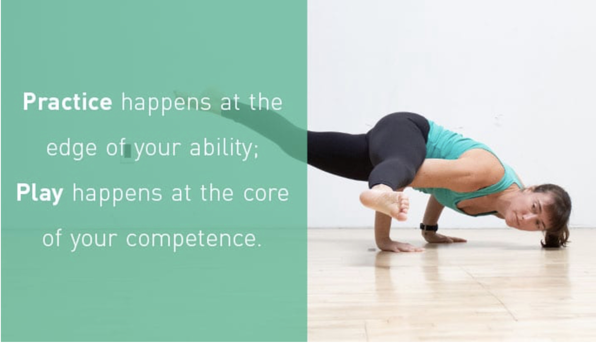

# Handstand Challenge 🙌


This was originaly a part of my \#Playful Movement focus area for [2020](2020/), and then \#Acrobody focus area for [2021](2021/).  
  
It turned out to be quite a short-lived experiment. It lasted from 25th of April until mid July. I restarted the process in January 2021, but only kept it until March.


I **started the experiment** on the 25th of April 2020, with playing around with handstands without any knowledge on how to structure my training–just to get a feel if that’s something I enjoy.

Turns out that I do, so I dived deeper.

I found this amazing [Handstand Tutorial](https://gmb.io/handstand/) on the 6th of May and it inspired me to take practicing handstands seriously. I’m implementing the five step strategy from there:

**Prep - Practice - Play - Push - Ponder**

For now I’m not committing to a specific chunk of time to ease the resistance of starting another practice \(my daily routine is quite packed already\). I’m hoping that **a combination of play-first approach with a proper training structure will create a self-reinforcing loop of improving my skills while having a total blast.**

Let’s see what happens.

### Log


You can see our [Handstand Challenge 🙌 Video Playlist](https://www.youtube.com/playlist?list=PLKo0x-_tqIHnfiOlJTapNiW9jn7SpT66V) on Youtube.


3 June: It’s a bit sad but I haven’t been practicing in quite a long time. But that’s okay. I’ve just rebooted my [routine](routine-design.md) and I’m excited to start playing with handstands again. \(I’m switching to dates, because day numbers are confusing\).

Day 17: This time we took advantage of the sunny weather, went outside and did some [play with no wall](https://youtu.be/iCn-xMu7oTc)

Day 15 and 16: **Taking a break**. Until now, we’ve been doing handstands every single day and **we can feel that our bodies needs a bit of rest.** The tutorial we’re following suggests practicing handstands 4 days a week. That definitelly makes sense.

Day 14: [Practice with a wall](https://youtu.be/30hSsIXF-Fw)

Day 13: [Playing with a free-standing handstand](https://youtu.be/BiNcidpsSpc) and [Reflection](https://youtu.be/D4-0Og3xex0)

Day 12: Embarking on a [”serious” handstand challenge](https://youtu.be/5vLDqlUpNpk), after finding [this tutorial](https://gmb.io/handstand/).

Day 3: [Testing the Waters](https://youtu.be/LvJLA3P0Ymk)

Day 1: 25th of April\*

\*To be fair, I’m not exactly sure how to decide on which day was really the first, so I picked one that kinda made sense. I intuitively feel it’ll be advantageous to keep a log of days–perhaps that’s the sailor in me speaking ⛵️.

### Tasks

* [x] Reach out to a friend of mine who happens to be a [badass handstand coach](https://www.instagram.com/phillipnassen) and ask if he’d like to give some feedback on this strategy. See if there’s anything I could offer to in exchange to make his life more amazing.

