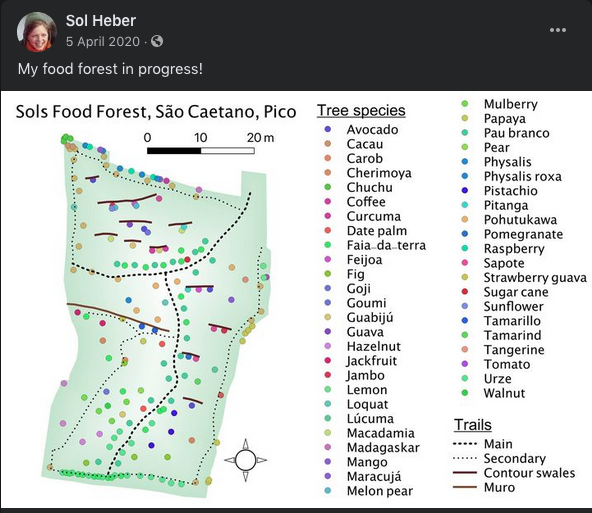
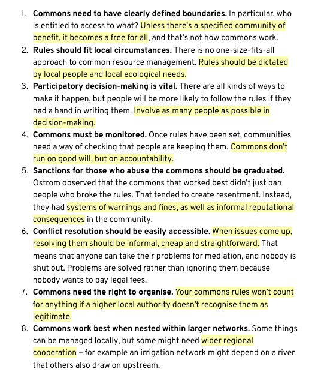
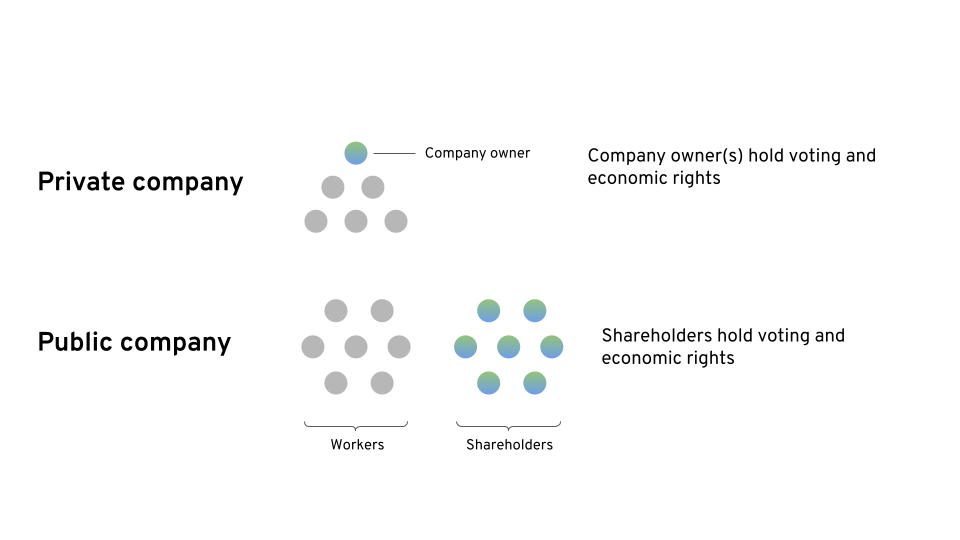
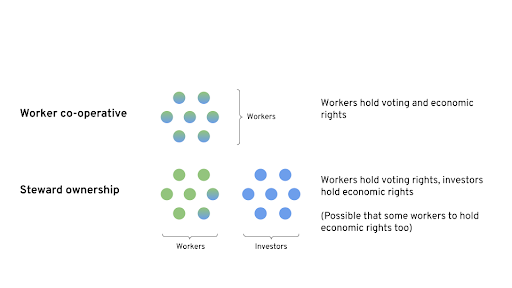
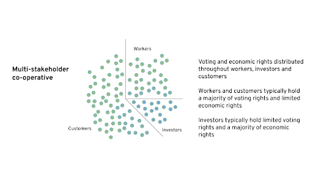

# Learning Log: Regenerative Renaissance Course

This is my learning log from the [_Tools for the Regenerative Renaissance Course_](https://dandelion.earth/events/606dd3e63acbbf000ddaf497)_._

The log compiles **key insights**, **questions** for further exploration, **public notes created**, and **resources** I found the most relevant for my context. The ideas here are taken from the course, its materials, or inspired by it.

_Note: This is work in progress. I intend to keep coming back to this log and keep updating it with notes._

#### About My Context:

I live in Pico, a **small island in the Azores archipelago, where I am catalysing a regenerative community using microsolidarity framework**. My long-term goal is to catalyse an archipelago-wide network of regenerative communities, ideally from a sailboat ⛵️.

You can [see my documentation here](https://pico.microsolidarity.cc).

### 1. Soil, Decentralised Energy, Decentralised Connectivity

#### 💡Insights:

* Soil is the key to regeneration
* I really resonate with cultivating agroforests and [Ernst Gotsch's work](https://www.youtube.com/channel/UCf9s-yeskYZweEuKyq1ia6w)
* I can't wait to commit to a piece of land, so I can start building something long-term. It's in fact one of the key things I'm [manifesting](https://journal.michalkorzonek.com/manifesting) right now.
* Working with regenerative agriculture is easier than I though. In fact, it's something most of my close friends in the island are already doing, and I have been learning by osmosis. 

Insights from [Daniel Christian Wahl - Designing Regenerative Cultures](https://open.spotify.com/episode/06aiatabh0DETdMmsesjdN?si=8PJ0_QqdQ6ehF0FKWXRG-g):

* Answers and solutions of today can create problems of tomorrow. Most people want to do good. Questions are more powerful than solutions. Creating solutions happens through testing questions.
* Rites of passage have embodied doubt of survival – it's not sure if you will make it through, so you accept your mortality.
* Wanting certainty is a pathological fear of death
* Technology resembles religion on many ways - fear of death, allowing eternal life... Life is so much more powerful than technology
* Future is unpredictable, so focus on creating conditions for emergence.

#### ❓Questions:

**How do we get energy on Pico?**

* There are only a few wind-turbines, which seems silly considering the amount of wind we have
* Even if having solar panels, it's still necessary to have a contract with EDA \(public electricity provider\) – research projects who are completely off-grid.

**Who controls the energy supply?**

**Is microgrid a viable idea in our context? Would it be community-wide or island-wide?**

**How to map our community effectively?**

* I've started this process during our [Pico Summer Gathering](https://pico.microsolidarity.cc/projects/summer-gathering-2021)
* I'm struggling with finding a good format for the map. Perhaps I'm too attached to visual mapping, and should go for a database first, as it's simpler
* Should the community map be public or private \(for community access only?\)
* Example [map of regenerative projects](http://regen.earth)

**How could we bring decentralised internet mesh network to Pico?**

* Looked into [Helium](https://www.helium.com/use), but it doesn't seem viable in the Azores \(yet?\)
* It takes 15 supernodes to cover the whole New York with a decetralised internet. What about Pico considering it's geography?
* What's the cost of a supernode?

**How to make low effort compost?**

* worth revisiting, when I commit to a piece of land.

**Does the money that's coming your way resonate with what you hold dear?**

#### 🗒 Notes:

* [Aquaponic Farming in Pico](https://beta.thewhitelog.com/notes/aquaponic-farming)
* [Tweet threed about an aquaponic farming project in Pico](https://twitter.com/michalkorzonek/status/1394632685461639168)

#### 📚Resources:

* [Decentraslised Connectivity Video Playlist](https://www.youtube.com/playlist?list=PLMAEqstRcvnuMMjyi5fUxFMXvRFzbtKd8) 
* [Microgrids and Virtual Power Plants Video Playlist](https://www.youtube.com/playlist?list=PLMAEqstRcvntRjh5CAM10Zl3U5bN547Us)
* [Ernst Gotsch's Youtube Channel](https://www.youtube.com/channel/UCf9s-yeskYZweEuKyq1ia6w)
* [Daniel Christian Wahl - Designing Regenerative Cultures](https://open.spotify.com/episode/06aiatabh0DETdMmsesjdN?si=8PJ0_QqdQ6ehF0FKWXRG-g)
* [SolarCity and Tesla: Ta'u Microgrid](https://www.youtube.com/watch?v=VZjEvwrDXn0&list=PLMAEqstRcvntRjh5CAM10Zl3U5bN547Us&index=5)
  * microgrid on an island. Up to 3 days with no sun, recharges in 7 hours.

### 2. Ethical Technology, Digital Tools for Collective Intelligence

#### 💡Insights

* The core problem with tech is that we're being optimized for extracting attention, and economic forces make it very difficult to escape this dynamic.
* We're "chimps with lazers" – we need wisdom to wield our god-like technology
* Algorithms can create social biases in ways that we can't yet imagine, at an accelerating rate. Who codes matters, how we code matters. And yet again, with the market forces at the core, this is bound to end up in a bad place.
* Public parks allows very different people to gather, see each other, and coexist in the same space – way to navigate through filter bubbles online
* Can we imagine a social network designed in a different way: to encourage the sharing of mutual understanding rather than misinformation? Instead of optimizing for raw engagement, networks like these would measure success in terms of new connections, sustained discussions, or changed opinions

#### ❓Questions

**What would social media look like if it served the public interest?**

**How could my community in Pico to move to ethical platforms from Facebook? What would it take for the whole island to do the same?** 

**How would a tool like** [**pol.is**](https://pol.is/home) **work in Pico?**

#### 🗒 Notes

#### 📚Resources

* [Aza Raskin from the Center for Humane Technology on the impact of technology on the human condition](https://www.youtube.com/watch?v=rwURKR4TdbU)
* [To Mend a Broken Internet, Create Online Parks](https://www.wired.com/story/to-mend-a-broken-internet-create-online-parks/)
* [A Scuttlebutt Love Story](https://vimeo.com/236358264)
* [Introducing Junto - A New Breed of Social Media](https://www.youtube.com/watch?v=z4Fb5x1RAmk)
* [Can Taiwan Reboot Democracy?](https://www.youtube.com/watch?v=VbCZvU7i7VY)
* [Odysee Video Platform](https://odysee.com/)
* [These guys](https://ipfs-search.com/%20) are building a decentralised google alternative which works on a P2P very similar to torrent. Everyone downloads a piece of internet on its own computer and keep seeding with the world.

### 3. Decentalised Organising & Horizontal Leadership

#### 💡Insights

* commons is community
* business as commons: self-determined salaries based on each project + collaborative decision making
* Changing the system deosn't make people show up differently on a Monday. Start with personal practices, evolve through informal, then finally formal experiments
* My business works like a decentralised org, although with two people only is a different dynamic.

#### ❓Questions

**Is there a "worky" decetralised org I'd like to be a part of?**

* I'm already a part of [Enspiral](https://enspiral.org), which is a great learning place

#### 🗒 Notes

* This is a direction I want to take for the [Evolving Experiences](https://pico.microsolidarity.cc/projects/evolving-experiences), an emerging collective of experience creators in Pico.

#### 📚Resources

* [The future is in business as commons \| Samantha Slade \| TEDxGeneva](https://www.youtube.com/watch?v=1qkhWa9XoFo)
* [Lean and Agile Adoption with the Laloux Culture Model, copyright Agile for all](https://www.youtube.com/watch?v=g0Jc5aAJu9g)

### 4. Co-operative Ownership

#### 💡Insights

* Artificial scarcity is the operating principle at the core of predatory capitalism.
* Defense mechanism to scarcity in life is denying things to others, which perpetuates the spiral
* Attaching a life to a job makes the life itself scarce.
* The tragedy of the commons: taking first before somebody else does

8 principles for running the commons by Elinor Ostrom

* Tool library is a total fit for Pico / Azores!
* In companies: Voting rights / economic rights ⤵

#### ❓Questions

**How could we start the tool library?**

* this seems like a very tangible and easy way forward for Pico, and we already have the base structure for it within our community.

#### 🗒 Notes

#### 📚Resources

* [Why Artificial Scarcity is Killing You: How Predatory Capitalism Breaks Societies, Economies, and Minds](https://eand.co/why-artificial-scarcity-is-killing-you-d19ff364c812)
* [https://ownyourdata.foundation/](https://ownyourdata.foundation/)
* [Edinburgh Tool Library](https://edinburghtoollibrary.org.uk/advice-for-new-sharing-libraries/)
* [Community co-rental idea](https://www.kasaba.co/)
* [FairBNB](https://fairbnb.coop/how-it-works/)

### 5. Regenerative Money

#### 💡Insights

* Money is an agreement. We can change the agreement.
* Once you don't need to pay rent and buy food the game suddenly changes completely.

#### ❓Questions

**How could we create an alternative economy within the island/archipellago? How could it look like?**

* there is a natural culture-based exchange economy in place. There's no need to reinvent the wheel, but rather go back to what used to work.

**If a network of Azorean communities function without traditional money, how would the exchange look like?**

#### 🗒 Notes

#### 📚Resources

* Money alternatives: [Seeds](https://www.joinseeds.com/), [Circles](https://circles.garden/), [Celo](https://celo.org/)
* [Welcome to Proof of Humanity](https://youtu.be/R4-z118s-gM) 
* [The Evolution of Money - Gold, Dollars, Bitcoin & Seeds](https://www.youtube.com/watch?v=qF5aEd0d1SI&list=PLMAEqstRcvnvaljDkr1D5BlzwltMyVgAZ&index=8)
* [Sacred Economics Video](http://sacred-economics.com/film/)

### 6. Wrap up

#### 💡Insights

* Activism: What am I activating?
* Sustainability is an important bridge to cross on the way to regeneration
* Less Zoom more work in the field, connecting with neighrbours and communities and solving local problems.
* 80/20 rule: 80 local / 20 international

#### ❓Questions

**How could I sustain myself financially while working more within the island, rather than online?**

* crowdfunding a tiny house and document the process? \(If I don't need to pay rent and live within community where I grow food, then my financial needs are minimal\).

**What is the mission in Pico, the Azores, and in Life?**

* that's a deep fucking question, but it's good to keep it in constant awareness, as a personal compass.

**Now that the course is over, how can I synthesise the overwhelming amount of information into something practical I can actually do with right now?**

#### 🗒 Notes

#### 📚Resources

### Insights from a sense-making call

**How to navigate so much information?**

* Sensemaking map, recognise places I know and gaps I want to explore

**Learning vs Doing**

* The big picture is so big that it unfolds infinitely. Need to take action, otherwise get stuck inside an infinite rabbit hole

**Sense-making**

* Not theoretical preaching, but deep listening

**How to navigate starting/joining a community?**

* It's not about creating communities, but growing them.
* How do we orient towards emergent community.
* How do we optimise for conditions that are conducive of communities to emerge?

**Unlearning of taking control, let go and let things emerge.**

