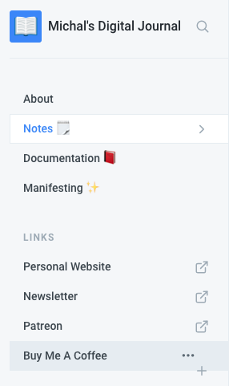
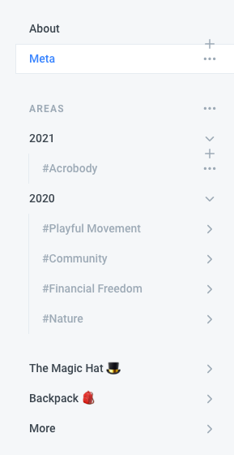
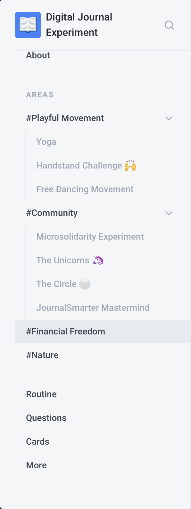

# Log

### Summer Reboot \(28 June 2021\)

It's been a while. I've reorganised this journal quite a bit. It feels simpler, and it now serves a purpose – a complimentary, more bloggy, counterpart to my [personal website](https://michalkorzonek.com). I like the website and I love working with [Carrd](https://try.carrd.co/sfzwv59j) \(affiliate link\), but it has it's limitations. Let's see if I can use this gitbook to work around them.



I should probably integrate this gitbook with carrd and have one simple website, but I feel resistance to spending time coding \(I'm not a coder\) and I refuse to use wordpress, because it's a freaking pain in the ass to use \(at least for me\). Also, it feels like I still haven't found an optimal structure that works for me, so it makes sense to keep this page as a Gitbook so I can move things around freely whenever I want with pretty much no effort.

### Long Time No See

24 Feb 2021

I've done some gentle polishing today, and reorganised some sections to make more sense. This really needed to be done as I haven't been maintaining this digital journal for a while. Part of it is connected to perfectionism, part to procrastination, part to [documenting other stuff](https://michalkorzonek.com/#documentation), and part of it to a clear preference for analogue techniques. In any case, I'm currently exploring coming back to online documentation. If you're curious about how that goes, you can check out my [newsletter](https://mindjuggling.substack.com) \(which tends to be aligned with the Moon\).



### The Log vs Digital Garden

15 August 2020

I've been on and off with this journal. There's some resistance that I still haven't figure out, but that's okay. In the meantime I've created my [personal website](https://michalkorzonek.com) \(also on GitBooks for simplicity\) and launched [Mind Juggling](https://mindjuggling.substack.com/) — a personal newsletter / log type of thingy.

I'm still not clear on what's the relationship between those three. Is there even a point for this space to exist?

### Trimming and Watering

25 May 2020

I’m really enjoying the process so far. And it really does remind me of gardening \(or at least the idea I have of what gardening involves\).

Every sometime \(usually every day or two\) I make some little tweaks–either “plant” a new section, “water” an existing one by adding more content, or ”trim” some words. It’s really quite fun and it feels very effortless, since I’m doing as much as I feel like, whenever I feel like. No pressure.

I’m also enjoying the flexibility and simplicity of GitBooks, and there’s really only one thing that makes me slighlty annoyed: the URLs are becoming super long and create resistance for me. 

I’d rather keep a simple structure where every new page is an individual /slug living at the domain level:

```text
journal.michalkorzonek.com/slug
```

Rather than keep going deeper and deeper into categories...

```text
journal.michalkorzonek.com/category/subcategory/slug
```

I keep noticing that the more this project expands, the more resistance I feel towards categories and subpages. It’s just not how my brain works.

I couldn’t find a way to do it in GitBooks, and while I’m considering alternatives,  so far I haven’t found anything that seems as simple to use as GitBooks. So I’m sort of stuck here for now. That’s okay–I’m still enjoying the process.

Feel free to share an alternative with me, if you know of one 🙏

### Finding the Structure

11 May 2020

When I started this experiment I thought I have a good idea on how to structure the site itself. Turns out I didn’t. 

As I keep putting more love into this project, I’m realising how it can be improved. This is not surprising, but it’s somehow new for me. Even if I know that I should focus on shipping the MVP, I still get stuck in the idea of getting it ”right” from the start. So silly.

By doing this project I’m proving to myself that it’s more effective to just do it, and then optimize along the way.

And I love seeing how flexible this digital journal is.

Let’s see how it evolves.

### 



### Asking for help 😨 

8 May 2020

I feel like a total n00b not being able to make this gitbook appear as a subdomain on my website. In a parallel universe I’m a hacker with some mad katana skills \(think Hiro Protagonist in [_Snow Crash_](https://en.wikipedia.org/wiki/Snow_Crash)\) , but let’s face it–in this one I’m more of a “forest person”. 🌳

This forces me to ask for help, which is a good opportunity to **practice asking for help**. And it’s not something that comes easy–I feel vulnerable, my ego feels threatened, and I don’t want to be a hassle for others.

So I tell myself: 

’It’s okay. I don’t need to be perfect.’

A gentle smile appear on my face.

‘I just need to be kind.‘

And I shyly reach out to a friend and ask.

\*\*\*

An hour later, it turns out that the joke’s on me–while sending screenshots to my friend I accidentally fixed the problem and it works now. Life is so funny.

