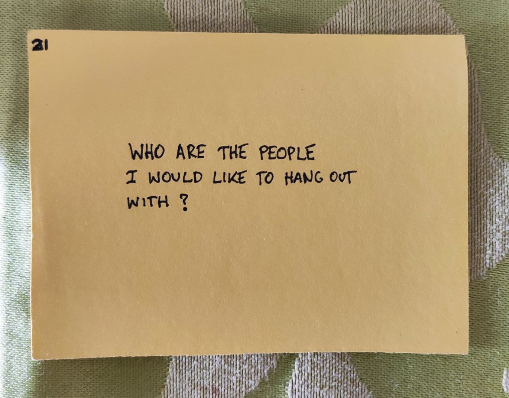

# Microsolidarity Experiment


Many months and experiments later, I think I can call myself a "microsolidarity practitioner". But I did start from zero \(and not so long ago\), and this page shows how I did it. Don't let excuses stop you.


Discovering [Microsolidarity](https://microsolidarity.cc) at the beginning of 2020 was a **huge** milestone for me.

The idea resonated on a deeper level, gave me a vocabulary to operate within, and most importantly, **ignited a spark within my soul** prompting me to take action. Thanks, [Rich](http://richdecibels.com/), I'm forever grateful 🙏

I'm not going to go into details of what this whole thing is, because the site I linked to above explains it better than I can. If you're interested in growing intentional relationships and support each other in doing meaningful work, it's a must-read.

With that out of the way, here's my practical take on weaving a cosy basket of wonderful social interactions.

### Finding the People

I’ve asked myself a question:

And then made a list without thinking too much about it. I let it sit in for a few weeks and gradually kept adding people, and moving them around into groups that I felt would make sense to meet together.

Eventually, when time felt right, I mentioned to some of those people, that I’d like to launch ”mastermind groups” and test the waters and see who is interested. I used the word _mastermind_ as it seemed more familiar to the people in my network. Eventually I shifted to terminology suggested in Microsolidarity, with one exception: using "pods" instead of "crews" for a small group of people \(4-6\).

Some time later, I felt like I have a person that's really excited to do it, so we exchanged a few emails and then jumped on a call. Funny enough, we barely knew each other \(I met the guy once and we barely even talked and my partner talked to him maybe three times\), yet it felt like the perfect match. He brought in his partner and suddenly there was four of us—a perfect number for our first Microsolidarity pod experiment: _The Unicorns_ 🦄.


Note to self: **Don’t wait for the people to find you. Take the role of “The Caller” and reach out.** 


Some time later, I reached out to another two people and now I have second pod in the making. I feel like I have space for one more, before it becomes too much to handle, but I'm not in a rush to start. I'm just waiting for a combination of people that will feel intuitively spot on.

In the meantime I co-created a little experiment with my housemates: _The Circle_ ⚪️, which was my first presential microsolidarity experience. A few months later I've started my biggest microsolidarity project so far: applying this wonderful framework to an entire island, which eventually became it's own documentation project.

### Digital Microsolidarity Experiments







### Presential Microsolidarity Experiments





