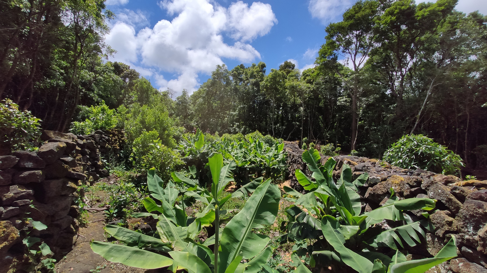
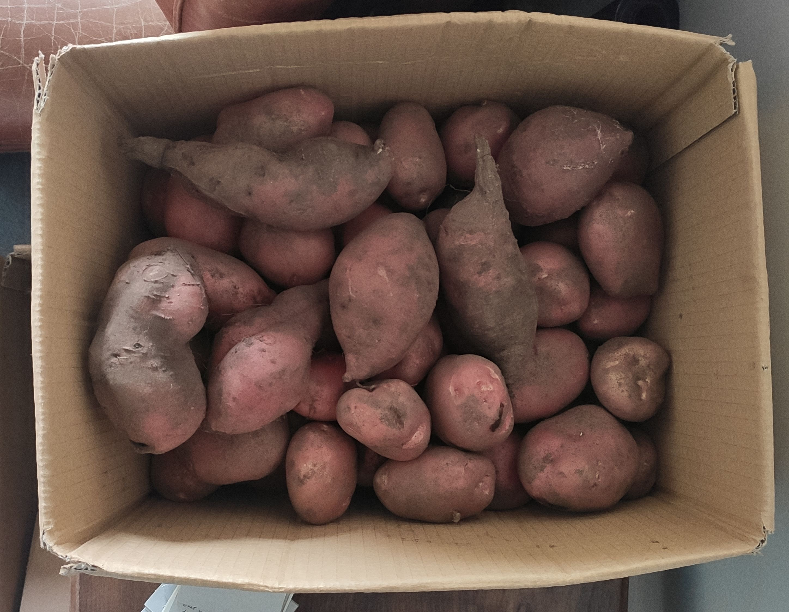

# Microsolidarity in Pico 🗻


It's happening—we made a decision to stay and we planted a seed for our congregation. Now it's time to grow.


Public documentation as it happens:



Inspiration: [Microsolidarity](https://microsolidarity.cc), [Game B](https://www.gameb.wiki/index.php?title=Game_B), [BaseX Island](https://basexisland.com/)

### Log


The documentation is now in it's own website \(link above\).


**27th of May**

We’re visiting two wonderful places–a [syntropic agriculture](https://agendagotsch.com/en/what-is-syntropic-farming/) project, and an intentional community in a state of incubation. We’re mindblown and inspired with the possibilities, and what’s already happening here.

**26th of May**

We’re getting to know more people in the island, especially the locals. 

And the news spread fast. Everyone in the village already knows in which house we live, and everyone is very helpful and keen to interact. And each time we interact with someone, we end up recieving vegetables from their gardens.

My little victory is hearing that I was thought to be Portuguese, because of how naturally I say ’bom dia’ \(‘good morning’\). 

**17th of May**

After 90 days in Pico Island, we met some amazing people who are already developing ProtoB-like projects on this magical island. We couldn't help but start thinking about participating in some way.

It seems that this island ticks a lot of boxes for us:

* [x] Stunning nature and easy access to an ocean, mountain and forest
* [x] Can grow a variety of fruits \(from apples to bananas and papayas\)
* [x] Cheap living costs
* [x] Already existing international community
* [x] A lot of Sun \(we loved living in Scotland but it’s just too dark for half of the year\), apart from that we don’t care about the weather to be “perfect”, Scotland weather-proofed us for life.
* [x] Good geographical location \(which is a combination of climate, remoteness, accessibility, time-zone and visa regulations\)
* [x] Low strategic value
* [x] Hassle-free beaurocracy \(it’s not really hassle free, but since Silvia is Portuguese and I’m an EU citizen it’s as hassle-free as it can get\).

Next steps: do a proper reconaissance of the island, get to know the land and people.

