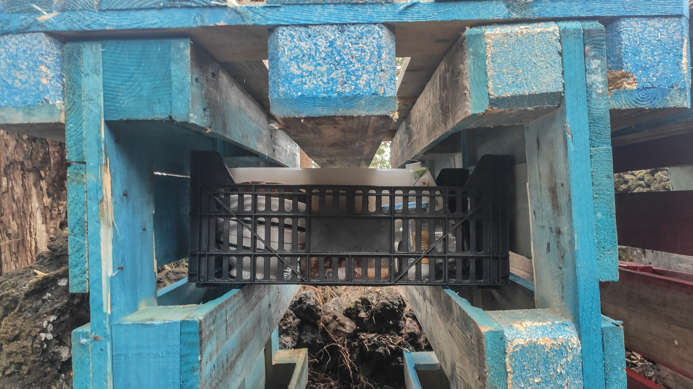

# Simple table from pallets


This is a part of my [Forest Log 🌳](forest-log.md).


Materials: 3 pallets \(ideally of the same kind\) per table.   
Building time: 30m   
Skills required: null  
Tools required: null \(although a hammer and nails would allow to secure it better\)

### MVP Instructions

1. Level the ground
2. Place pallets for legs, make sure they are even
3. Place the table surface pallet on top \(sliding works well\)
4. Optional: secure by nailing an additional piece of wood connecting the legs together

The surface under the table can be used as storage:



Here's my happy face after building this bad boy ⤵️



---

Subscribe to my [Moonly Review](https://mindjuggling.substack.com/) for meaningful updates. And if you want to support me to create and share more with you, here's [the link](https://www.buymeacoffee.com/michalkorzonek).

