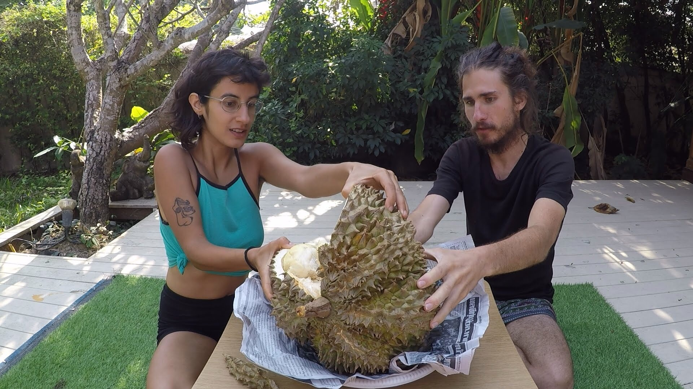

# My Favourite Dyad

We're a polyamorous, location-independent couple of entrepreneurs, artists and acrobats, with a ridiculous sense of humor, passion for creating meaningful experiences together, and a shared interest in helping each other to become the best versions of ourselves, so we can help others do the same. 

Oh, and we like fruits. Especially durian.

Over the past few years we've experimented with a lot of intentional "relationship development" practices. Gradually I'll be adding some of the key take-aways here.

TBC

