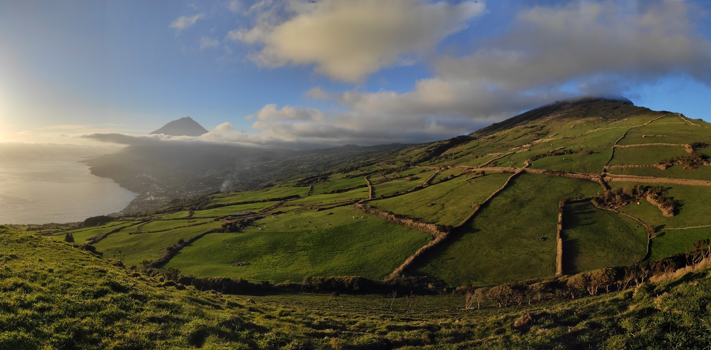

# Tools For Regenerative Renaissance in Pico

This is my reflection on the [Tools for Regenerative Renaissance Online Course](https://dandelion.earth/events/606dd3e63acbbf000ddaf497). But before we dive into it, here's a little bit of context.

### Discovering Regenerative Renaissance

I came to the Azores in February 2020 with the intention of staying for two months. As I'm writing these words, a year and a half later, I'm not only still here, but I feel like this corner of the world will be my home for the long-game.

My arrival here coincided with coming across [Microsolidarity](https://microsolidarity.cc): a framework for building mutual-aid communities, with a simple principle at the core – _people before projects._ This idea not only really resonated with me, but have helped me define the new course for my life. I've committed to a long-game experiment of implementing this framework in Pico, to see what happens.

🌱

Witnessing the seeds you have planted sprout is a wonderful feeling. While our congregation is still in it's early days, there are already exciting projects popping up. What's perhaps more important is the growing feeling of having a family in the island. It really is something special, especially due to our context:

Pico is not a transition-island, where people come for a semester and leave. On the contrary, **most of people in our congregation are here for the long-game. This gives us time to build trust and weave social fabric without rushing** \(OMG I'm leaving in three days, I need to do everything NOW!!!\), **which in turns creates perfect conditions for something wonderful to emerge.**

You can follow our journey on [pico.microsolidarity.cc](https://pico.microsolidarity.cc).

As our congregation kept maturing, I've noticed a need in myself to level up as a community catalyst, so I can give more to the island, and move towards a bold North Star, which I'm going to verbalise out loud for the first time right now:

**Make Pico \(and the Azores\) the best place to live on Earth.**

And just to make it clear, that's not a competitive objective \(the more of these places on Earth, the better\), but a direction to aim towards. Kudos to [Marc Winn](https://marcwinn.com/) for inspiring this mindset with his [Dandelion Project](http://dandelion.gg/) in Guernsey Island 🙏.

One day, I came across the _Tools for Regenerative Renaissance Course_ on [Enspiral](https://enspiral.com)'s Slack and I immediately felt like this is precisely what I need.

### Finding The Right Tools

> _"Discover the tools to build your own vision."_  – Mary Anne Radmacher

The Tools for the Regenerative Renaissance Course is the most comprehensive \(and ever expanding\) library of regenerative tools I ever came across, organised in a few subjects:

* Regenerative Agriculture & Thriving Local Economies
* Digital Tools for Collective Intelligence
* Decentralised Organising & Horizontal Leadership
* Co-operative Ownership
* Regenerative Money

Here's a [wiki version](https://wiki.renaissance.university/), which is one of a very few bookmarks in my browser.

The course runs in cohorts, spanning over 7 weeks. In other words, it's not only a library, but a community of beautiful people actively seeking ways to regenerate our planet, facilitated by two highly-skilled and inspiring souls: [Phoebe Tickell](http://www.phoebetickell.com/) and [Stephen Reid](https://stephenreid.net/), and a team of stewards composed of previous students.

While the potential of this combination is pretty much infinite, the amount of information shared during the course is quite overwhelming. It took me a while to navigate my way through the FOMO of learning about all the books, podcasts, videos etc. that I could never potentially consume in my entire lifetime, until I found my own way of navigating the course.

While I'm naturally biased towards action and learning by doing, I also struggle with falling into rabbit holes of infinite research. Fortunately, I managed to avoid this trap with the course, by deliberately focusing on the tools, resources and ideas the most relevant for me right now.

**My goal was to scan through everything the course has offer and build a "mental map" helping me to understand gaps in my knowledge, as well as the optimal path I could follow immediately. As I reach the next milestone, I'll revisit the map and pick the new trajectory.**

Immediate actionability and iterative growth is key.

One of the components that helped a lot in the sense-making process, was keeping a learning log \(in my [Obsidian](https://obsidian.md) Vault\) compiling all the ideas that came up from engaging with the content and people in the course. I have then processed it into a shorter public version with the most relevant insights, questions, notes and resources. Throughout this process, I've destiled two actionable steps for me to take right now:

1. Publish a MVP version of the Pico Project Map.
2. Explore the possibility of setting up a Tool Library in Pico / Faial.

The **Pico Project Map**, is a compilation of regenerative and regenerative-aligned projects in the island. I've started the process a while ago, and then opened it to collective intelligence during our [Pico Summer Gathering](https://pico.microsolidarity.cc/projects/summer-gathering-2021). I haven't been able to publish an updated version yet, but it is now clear to me that it's a very tangible next step I should take right now.

The **Tool Library**, is an idea I came across while visiting an emerging community project in a neighbouring island of Faial, only to then find it in the resources of the Regenerative Renaissance Course. This seems like an obvious thing to put my energy into. There is a clear need, we have resources, and we have talked about similar ideas during our [sharing circle](https://pico.microsolidarity.cc/sharing-circle) and community conversations.

Here's my [public learning log](https://journal.michalkorzonek.com/notes/learning-log-regenerative-renaissance-course), which I intend to expand over time, by linking to new notes and projects I'll be engaging with. You can also get my [🌑 Moonly Reviews 🌕](https://mindjuggling.substack.com) to receive most relevant updates.

### Meta Reflection

As a course-creator and a big fan of meta reflection, I can't help but share a few insights about the course:

* "The better than free" model is absolutely wonderful and highly motivating.
* The pace of the course feels quite fast considering the amount of material.
* I loved breaking the course down with a reading week in the middle. It certainly helped to stay on track with the content.
* The biggest bottleneck for me was the amount of content to engage with. While this is the premise of the course, it might feel overwhelming, which might discourage some participants. I'd look for ways to implement more actionability within real contexts \(not just "playing around with tools"\) into the course and help people make tiny steps forward with the tools they're learning about, apart from just processing the knowledge.
* Having guest speakers in the workshops was great. I've particularly resonated with [Daniel Wahl](https://www.resilience.org/resilience-author/daniel-wahl/), as we share similar context of working within an island.
* The course assignments at the end of the course are a great idea. That's why this very article and my public learning log exist. Writing in public is highly motivating for me, and it forces me to clarify my thinking.

In any case, I leave the course feeling enriched, inspired and clear on what are my next steps, so that's definitely a success. Thank you Phoebe and Stephen \(and the rest of the team\) for creating this experience.

