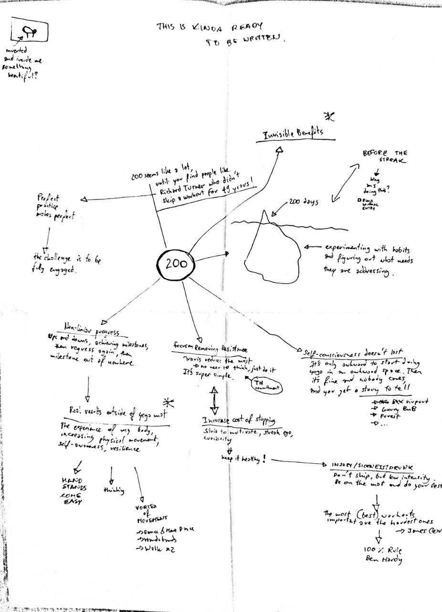

# Yoga


I've completed the streak of 235 consecutive days with 1 hour yoga practice. I've then decided to stop the experiment as I welt I needed a break and a different form of movement.


As I’m writing this \(30th of April 2020\) **I’m on a streak of 208 days without skipping a single day**. For a person who used to be unable to commit to anything for longer than 5 days, that’s quite an impressive result.

A friend \(who funny enough is a yoga teacher\) asked me to tell her about my findings. I’m working on an article on that in the back of my head, but for now you can see it on a little mind map.

Btw, this wouldn't happen without my [Minimalist Journaling System](2020/financial-freedom/the-minimalist-journaling-system.md).

